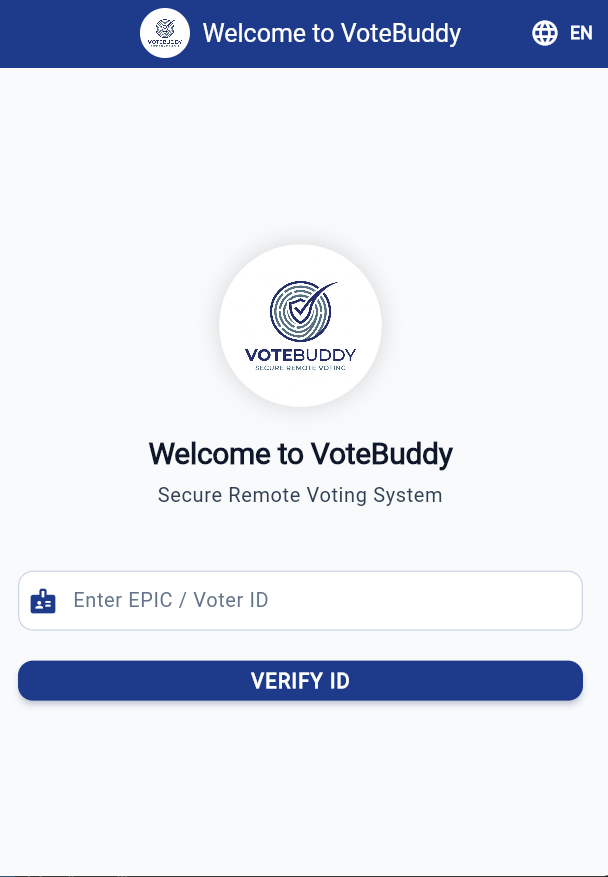
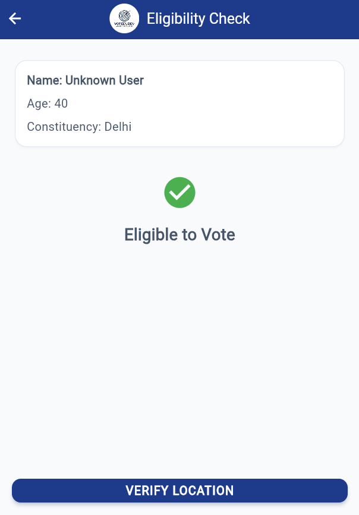
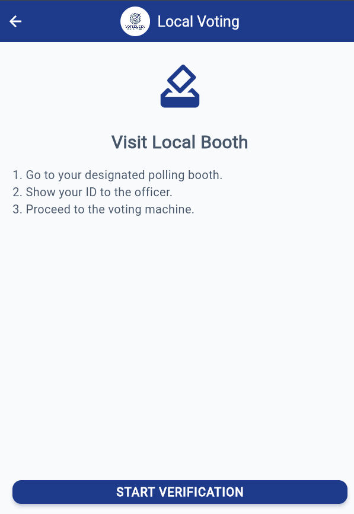
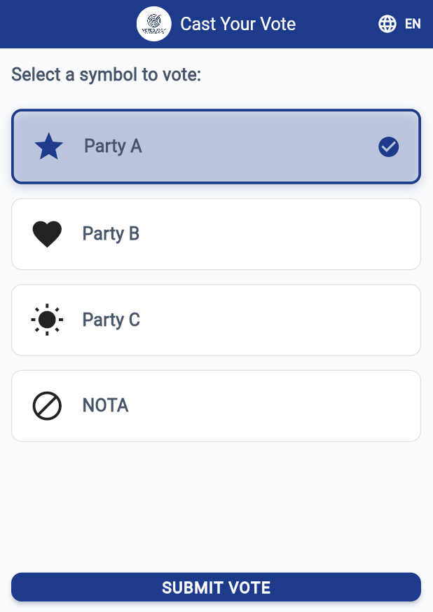
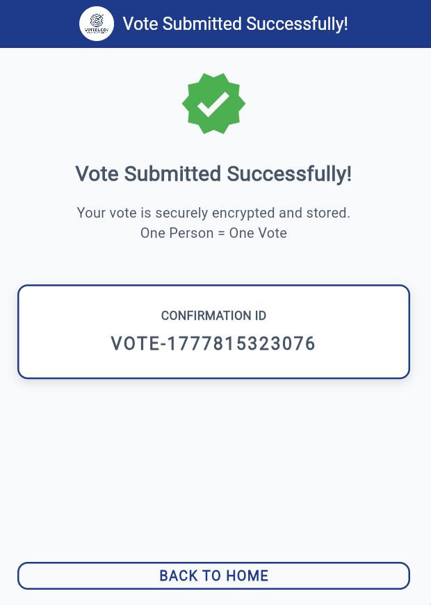
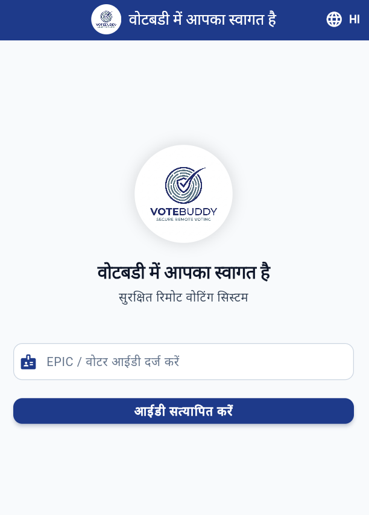

# 🏆 VoteBuddy Hybrid – Secure Remote Voting System

👉 **VoteBuddy Hybrid makes voting accessible, secure, and convenient for every citizen.**

## 📸 App Screenshots

  
  
  
  
  
  

## 🧠 Problem Statement
In India, many eligible voters face challenges such as long queues at polling booths, inability to travel to their home constituency, lack of awareness about the voting process, and accessibility issues for low-literacy users. These problems lead to low voter participation and inconvenience, especially for migrant workers and first-time voters.

## 🔥 Problems We Solve
- 🏠 **Migrant voters cannot travel to vote**
- ⏳ **Long queues at polling booths**
- ❌ **Fake / duplicate voting risks**
- 🧠 **Lack of awareness among users**
- 📄 **Voter list confusion (name missing issues)**
- 🌐 **Accessibility issues for illiterate users**

## 💡 Solution (Project Description)
VoteBuddy Hybrid is a secure and intelligent voting support system that enables both local and remote voting through a hybrid approach. It allows users to verify their eligibility via a mobile application and determines whether they should vote locally or through a secure Authorized Verification Node (AVN).

The system ensures strong security using biometric verification, voter list validation, and location-based decision-making. It also provides a simple and symbol-based interface, making it accessible for low-literacy users.

By combining digital convenience with controlled physical verification, the system improves accessibility, reduces crowding, and enhances trust in the voting process.

## 🎯 Main Goal (Objective)
To make the voting process more accessible, secure, and efficient for all citizens, especially for migrant and low-literacy users, by introducing a hybrid model that balances convenience with strong verification.

## 🚀 Vision (Future Scope)
To build a future-ready digital voting framework that can enhance participation, reduce barriers, and support a secure and inclusive democratic system.

## 🧾 Reason (Why This Project?)
“Many people want to vote but cannot due to distance, time, or lack of understanding. Our system aims to remove these barriers and make voting easier and more accessible.”

## 💻 Tech Stack
- **Flutter**: Cross-platform application framework
- **Provider**: State management
- **SharedPreferences**: Local persistence to prevent duplicate voting

## 🛠️ How to Run
1. Ensure Flutter is installed.
2. Clone or open this repository.
3. Run `flutter pub get` to fetch dependencies.
4. Run `flutter run` to launch the application.

*We are not replacing the current system, but enhancing it to include more people in the democratic process.*
